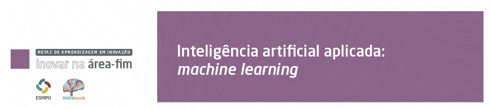

# Inteligência Artificial na prática: machine learning

Período de realização: 3, 5, 8, 10, 12, 15, 17, 19, 22 e 29 de maio (das 08h30 às 12h30).

Carga horária: 50 (cinquenta) horas-aula

Orientador pedagógico: Leonardo da Costa Lopes

Docentes: Erick Muzart Fonseca dos Santos, Fernando Luiz Brito de Melo, Jeronimo Avelar Filho, Thiago Coelho Vieira, Antônio Willian Souza.

Orientações Gerais:

Acompanhe a programação do curso, dias e horários das atividades no Projeto Pedagógico disponível na área "Informações";
Acesse as aulas regulares e as sessões de tutoria na área "Sala Virtual";
Confirme sua participação nas atividades nos respectivos links na área "Confirmação de participação". Atenção! Esse procedimento é obrigatório para obter o certificado;
Ao final, avalie o curso da área "Encerramento".

